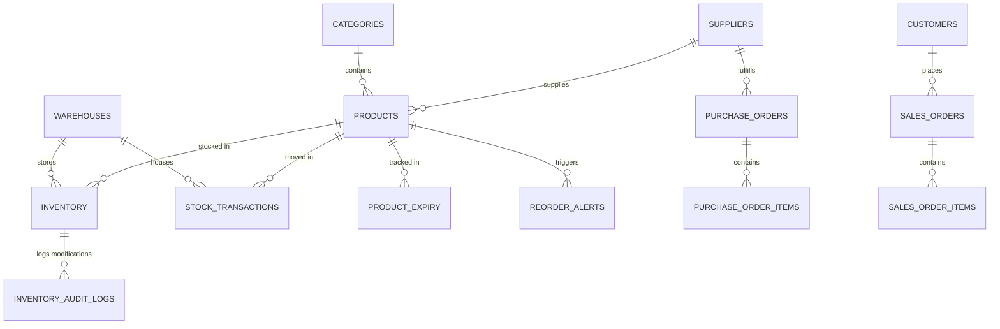

# NexSupply WMS - Enterprise Warehouse Inventory Management System

[](https://www.postgresql.org/)
[](LICENSE)
[]()

An enterprise-grade, database-first Warehouse Inventory Management System engineered to solve real-world inventory control challenges for warehouses, multi-channel retailers, manufacturing plants, and third-party logistics (3PL) providers.

---

## 🌟 Key Highlights & Business Capabilities

* **3NF Relational Database Design**: 15 normalized tables supporting multi-warehouse inventory tracking, batch/expiry monitoring, supplier ratings, and procurement workflows.
* **Automated Stock Triggers**: Real-time enforcement of non-negative stock levels, automatic reorder alert generation when inventory drops below reorder points, and immutable compliance audit logging.
* **Advanced Business Intelligence**:
  * **ABC Inventory Analysis** (Pareto 80/20 principle using `SUM() OVER ()` cumulative revenue percentages).
  * **XYZ Demand Volatility Analysis**.
  * **Dead Stock & Aging Detection** (Flagging products unsold in >180 days).
  * **Month-over-Month Growth & Forecasting** (Using `LAG()` and `LEAD()` window functions).
  * **Recursive Category Hierarchy Trees** (Traversing parent-child categories using Recursive CTEs).
* **Enterprise Sample Dataset**: Seeded with 100+ Products across 10 Categories, 20 Suppliers, 50 Customers, 5 Regional Warehouses, and 1,000+ Stock Transactions.

---

## 📁 Repository Structure

```
warehouse-inventory-system/
├── README.md                          # Master Project Overview & Setup
├── docs/
│   ├── ERD.md                         # Complete Entity-Relationship Diagram (Mermaid)
│   ├── SCHEMA_ARCHITECTURE.md        # Data Dictionary & Constraint Specifications
│   ├── INTERVIEW_QUESTIONS.md        # 15+ Advanced SQL Interview Solutions with Queries
│   └── PERFORMANCE_OPTIMIZATION.md   # B-Tree Index Strategy & Execution Plan Analysis
├── database/
│   ├── 01_schema.sql                  # DDL: 15 Tables, PKs, FKs, CHECKs, Indexes
│   ├── 02_views.sql                   # Standard & Materialized Business Views
│   ├── 03_procedures.sql              # Stored Procedures & Custom Functions
│   ├── 04_triggers.sql                # Triggers for stock updates, audit logs & reorders
│   ├── 05_seed_data.sql               # Seed Dataset (100+ Products, 1000+ Transactions)
│   ├── 06_business_reports.sql        # Analytics Queries (ABC/XYZ, CTEs, Window Functions)
│   └── 07_test_cases.sql              # Verification Suite & Constraint Test Cases
└── app/                               # Interactive Web Dashboard & Live SQL Sandbox
    ├── package.json
    ├── vite.config.js
    ├── index.html
    ├── style.css
    └── src/
        ├── main.js
        ├── sqlEngine.js
        └── schemaData.js
```

---

## 🚀 Quickstart & Setup Guide

### 1. Database Setup (PostgreSQL)
Run the SQL scripts in chronological order to initialize the database, seed data, and execute test cases:

```bash
# Create database
createdb nexsupply_wms

# Execute DDL, Views, Procedures, Triggers, Seed Data, and Analytics
psql -d nexsupply_wms -f database/01_schema.sql
psql -d nexsupply_wms -f database/02_views.sql
psql -d nexsupply_wms -f database/03_procedures.sql
psql -d nexsupply_wms -f database/04_triggers.sql
psql -d nexsupply_wms -f database/05_seed_data.sql
psql -d nexsupply_wms -f database/06_business_reports.sql
psql -d nexsupply_wms -f database/07_test_cases.sql
```

### 2. Launch Interactive Web Dashboard
Navigate to the `app/` directory to launch the web dashboard:

```bash
cd app
npm install
npm run dev
```

---

## 📊 Entity-Relationship Diagram (ERD)



---

## 💡 SQL Concepts Demonstrated

* **Primary & Foreign Keys**: Enforced referential integrity with `ON DELETE CASCADE` and `SET NULL`.
* **Constraints**: `CHECK` constraints (positive unit prices, valid status strings, capacity limits) and `UNIQUE` constraints.
* **Window Functions**: `ROW_NUMBER()`, `RANK()`, `DENSE_RANK()`, `LAG()`, `LEAD()`, `NTILE(4)`, `SUM() OVER ()`.
* **Recursive CTEs**: Multi-tier category tree traversal.
* **Correlated Subqueries & Self-Joins**: Stock movement speed, dead stock detection, and supplier lead time comparison.
* **Triggers & Procedures**: Automated reorder alerts, stock transfer isolation, negative stock prevention.
