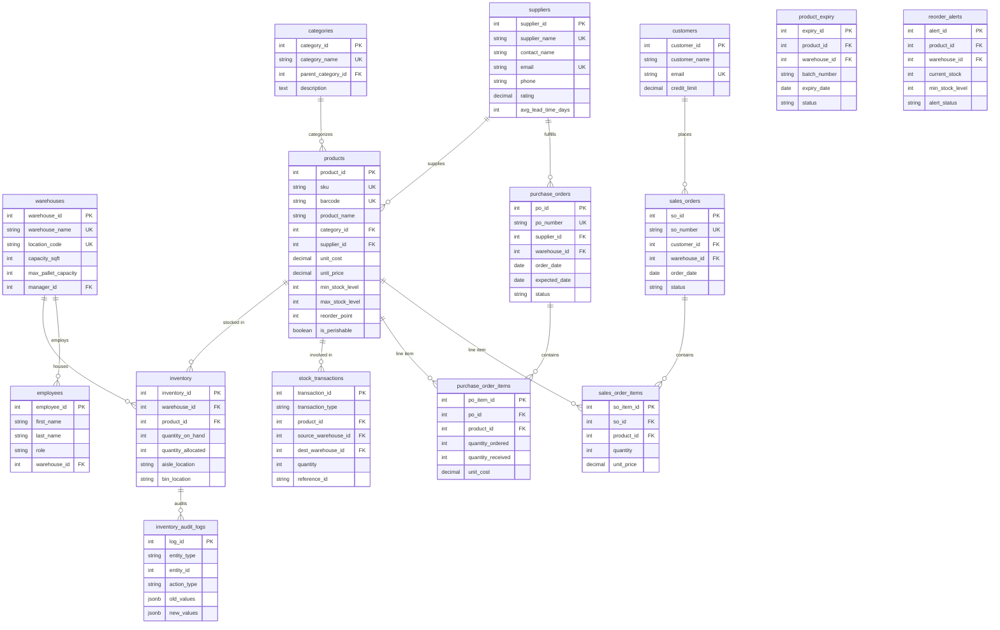

# Entity-Relationship Specification - NexSupply WMS

This document details the relational schema architecture, cardinalities, constraints, and keys for the 15 core tables.

---

## 1. ER Diagram (Mermaid Rendering)

---

## 2. Table Relationships & Cardinality Summary

1. **`categories` (1) to `categories` (N)**: Recursive self-referencing relationship (`parent_category_id`) allowing multi-tier product category taxonomy.
2. **`suppliers` (1) to `products` (N)**: One supplier supplies multiple products.
3. **`warehouses` (1) to `inventory` (N)**: Junction table enforcing unique `(warehouse_id, product_id)` pairs.
4. **`products` (1) to `product_expiry` (N)**: Enables multi-batch lot tracking per warehouse for perishable items.
5. **`purchase_orders` (1) to `purchase_order_items` (N)**: Parent-child header/detail structure for vendor procurement.
6. **`sales_orders` (1) to `sales_order_items` (N)**: Parent-child header/detail structure for customer order fulfillment.
